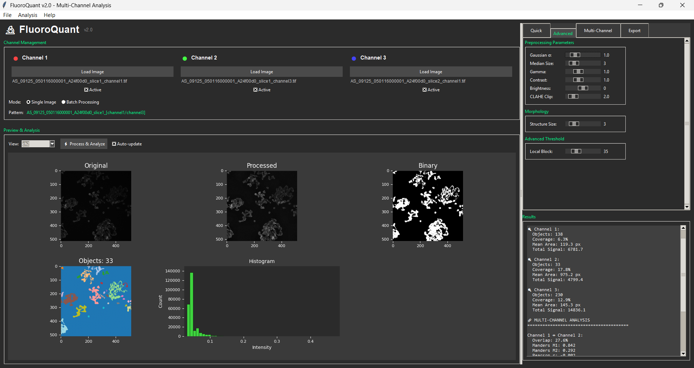

# FluoroQuant v2.0

A high-performance multi-channel fluorescence microscopy analysis platform designed for quantitative cellular imaging and colocalization studies in computational biology research.



## Overview

FluoroQuant addresses the computational challenges of large-scale fluorescence microscopy analysis through optimized algorithms, parallel processing, and robust statistical methods. The platform enables researchers to process multi-channel datasets with rigorous quantitative analysis while maintaining computational efficiency for high-throughput studies.

## Key Features

### Core Capabilities

- **Multi-Channel Processing**: Simultaneous analysis of up to 3 fluorescence channels with automatic image registration
- **Advanced Segmentation**: Implementation of multiple thresholding algorithms (Otsu, Triangle, Li, Yen) with adaptive local methods
- **Colocalization Analysis**: Comprehensive spatial correlation metrics including Manders coefficients, Pearson correlation, and Intensity Correlation Quotient (ICQ)
- **Distance Analysis**: Efficient nearest-neighbor calculations using spatial indexing (KD-trees) for object proximity studies
- **Batch Processing**: Intelligent pattern detection with parallel execution for high-throughput analysis

### Performance & Scalability  

- **Parallel Processing**: Multi-core utilization via `multiprocessing` for batch operations
- **Memory Management**: Image caching with memory monitoring capabilities
- **Spatial Optimization**: KD-tree indexing for efficient nearest-neighbor queries
- **Vectorized Operations**: NumPy-optimized algorithms for statistical calculations

## Installation

### System Requirements

- Python 3.8+
- 8GB+ RAM recommended for batch processing
- Multi-core CPU for optimal performance

### Dependencies

```bash
# Install core dependencies
pip install numpy>=1.21.0 scikit-image>=0.18.0 scipy>=1.7.0
pip install opencv-python>=4.5.0 pandas>=1.3.0 matplotlib>=3.4.0
```

Key dependencies include:

- `numpy>=1.21.0` - Vectorized numerical operations
- `scikit-image>=0.18.0` - Image processing algorithms  
- `scipy>=1.7.0` - Spatial indexing and statistical functions
- `opencv-python>=4.5.0` - Image I/O and preprocessing
- `pandas>=1.3.0` - Data export and manipulation
- `matplotlib>=3.4.0` - Visualization backend
- `multiprocessing` - Parallel batch processing

### Quick Start

```bash
git clone https://github.com/seanpcarmody/fluoroquant.git
cd fluoroquant
# Install dependencies (see above)
python FluroMain.py
```

## Architecture

The codebase follows a modular architecture designed for extensibility and maintainability:

```
FluoroQuant/
├── FluroMain.py              # Application controller and state management
├── fluoro_processor.py       # Image preprocessing and segmentation algorithms
├── fluoro_analyzer.py        # Quantitative analysis and colocalization metrics
├── fluoro_gui.py            # User interface and visualization components
├── fluoro_batch.py          # Parallel batch processing with pattern detection
├── fluoro_export.py         # Multi-format data export utilities
├── fluoro_memory.py         # Memory management and caching systems
└── requirements.txt         # Dependency specifications
```

## Design Decisions

### Performance Optimization

**Multiprocessing over Threading**: We implemented `multiprocessing.ProcessPoolExecutor` instead of threading to overcome Python's Global Interpreter Lock (GIL) and achieve true parallelism for CPU-intensive image processing operations. This design choice enables linear scaling with available CPU cores during batch processing.

**Spatial Indexing**: Distance analysis utilizes scipy's `cKDTree` implementation, reducing computational complexity from O(n²) for naive pairwise comparisons to O(n log n) for nearest-neighbor queries. This optimization is critical when analyzing datasets with thousands of detected objects per image.

**Vectorized Operations**: Core mathematical operations leverage NumPy's vectorized functions rather than Python loops, providing significant performance improvements for array-based calculations like Manders coefficient computations.

### Reliability & Validation

**Testing Framework**: The codebase includes test scaffolding and validation utilities for ensuring algorithm correctness, with particular focus on numerical precision in colocalization calculations.

**Error Handling**: The system implements graceful degradation for common failure modes (corrupted images, insufficient memory, interrupted processing) while maintaining data integrity and providing informative error messages.

**Numerical Stability**: Algorithms include safeguards against division by zero, invalid correlation calculations, and floating-point precision issues that commonly occur in biological image analysis.

### Extensibility & Maintainability

**Modular Architecture**: The separation of concerns (Processor, Analyzer, GUI, Batch, Export) ensures that new algorithms can be integrated with minimal changes to existing code. For example, adding a new thresholding method requires only extending the `ImageProcessor.threshold_image()` method.

**Algorithm Abstraction**: Core analysis methods are designed as composable functions that can be easily unit tested and replaced. This facilitates integration of new colocalization metrics or morphological measurements without architectural changes.

**Configuration-Driven Processing**: Processing parameters are externalized through configuration objects, enabling researchers to define analysis pipelines programmatically and ensuring reproducible results across different studies.

## Scientific Applications

### Colocalization Analysis

The platform implements industry-standard colocalization metrics:

- **Manders Coefficients (M1, M2)**: Quantify the fraction of signal in each channel that overlaps with the other
- **Pearson Correlation**: Measures linear relationship between pixel intensities in overlapping regions
- **Overlap Coefficient**: Ratio of coincident intensities to total intensities
- **Intensity Correlation Quotient (ICQ)**: Sign-based correlation metric robust to intensity variations

### Distance Analysis

Spatial relationship analysis includes:

- Nearest-neighbor distance distributions
- Object proximity analysis with user-defined thresholds  
- Center-to-center distance measurements between channel objects
- Statistical summaries (mean, median, standard deviation) of spatial distributions

## Performance Characteristics

Performance will vary based on image size, complexity, and system specifications. Typical processing times on modern hardware:

- Single image processing: 2-15 seconds per channel (depending on image size)
- Batch processing throughput: Variable based on file complexity and system resources
- Memory usage: Scales with image dimensions and number of active channels

## Export Options

The platform provides comprehensive export capabilities across multiple formats:

### Single Image Export

- **CSV Files**:
  - `*_ch1_objects.csv`: Individual object measurements for each channel (area, intensity, morphology)
  - `*_channel_summary.csv`: Per-channel statistics (object counts, coverage, mean values)
  - `*_colocalization_analysis.csv`: Manders coefficients, Pearson correlation, overlap metrics
  - `*_distance_analysis.csv`: Nearest-neighbor distances and spatial relationships
  - `*_object_pairs_*.csv`: Detailed object-to-object overlap data

- **JSON**: Complete analysis results with processing parameters and metadata in `*_complete_analysis.json`

- **Excel**: Multi-sheet workbook with summary, individual channel data, and multi-channel analysis

- **Images**:
  - Processed grayscale images (`*_ch1_processed.png`)
  - Binary segmentation masks (`*_ch1_binary.png`) 
  - Channel overlays with detected objects (`*_ch1_overlay.png`)
  - Colocalization visualizations showing overlap regions (`*_colocalization_ch1_ch2.png`)
  - RGB composite images (`*_composite.png`)

### Batch Export

Automated consolidation of results across multiple image groups:

- `*_all_objects.csv`: Combined object measurements from all processed images
- `*_summary.csv`: Channel statistics organized by image group
- `*_multichannel_analysis.csv`: Colocalization and distance data across the dataset
- `*_complete.json`: Full batch results with processing metadata

### Export Controls

Users can selectively enable/disable export formats through the GUI Export tab:

- Toggle individual format types (CSV, JSON, Excel, Images, Overlays)
- Auto-export option for batch processing workflows
- Custom file naming and output directory selection

## System Configuration

The application can be optimized for different hardware configurations by modifying the batch processing settings in `FluroMain.py`:

### CPU Optimization

```python
# In FluroMain.py, adjust batch processor configuration:
batch_config = BatchConfig(
    max_workers=8,          # Number of CPU cores to use (default: CPU count - 1)
    memory_limit_gb=16.0,   # Maximum RAM allocation for batch processing
    chunk_size=1,           # Images processed per batch (increase for small images)
    use_shared_memory=True  # Enable shared memory for large datasets
)
```

### Memory Management

For systems with limited RAM, adjust these parameters:

- Reduce `max_workers` to 2-4 for systems with <8GB RAM
- Lower `memory_limit_gb` to prevent system instability
- Increase `chunk_size` only for very small images to reduce overhead

### Performance Tuning

- **High-memory systems (32GB+)**: Increase `max_workers` to CPU core count
- **Large image datasets**: Enable `use_shared_memory=True`
- **Network storage**: Reduce `max_workers` to avoid I/O bottlenecks

## Contributing

### Development Setup

1. Fork the repository
2. Create a virtual environment: `python -m venv fluoroquant_env`
3. Install development dependencies: `pip install -r requirements-dev.txt`
4. Run tests: `pytest tests/ -v --cov=fluoro`

### Code Standards

- Follow PEP 8 style guidelines
- Include type hints for public APIs
- Add docstrings for all public functions
- Maintain test coverage >80%

### Performance Testing

```bash
# Run performance benchmarks
python -m pytest tests/test_performance.py::test_batch_processing_speed
python -m pytest tests/test_memory.py::test_large_dataset_processing
```

## Citation

If you use FluoroQuant in your research, please cite:

```bibtex
@software{fluoroquant2025,
  author = {Sean Carmody},
  title = {FluoroQuant: High-Performance Multi-Channel Fluorescence Analysis Platform},
  url = {https://github.com/seanpcarmody/fluoroquant},
  year = {2025},
  version = {2.0}
}
```

## Support

For technical questions and bug reports, please use the GitHub issue tracker. For research collaborations or custom analysis workflows, contact developer at scarmody@seas.upenn.edu .

---

**Technical Note**: This platform is optimized for biological image analysis workflows common in cell biology, neuroscience, and microscopy research. The algorithms and performance characteristics have been validated on typical fluorescence microscopy datasets (1024x1024 to 4096x4096 pixel images).
